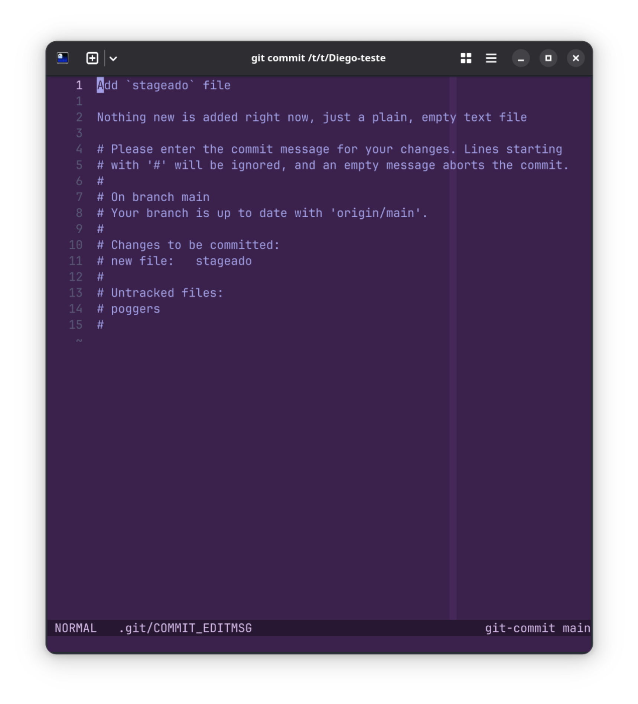

<!-- _header: '' -->
<!-- _footer: '' -->
<!-- _paginate: false -->

# Workflow de desenvolvimento: principais comandos Git e Shell
## SECOMP 2025
### Diego Augusto

-  [Diegovsky](https://github.com/Diegovsky)
-  [@diegovsky@fosstodon.org](https://fosstodon.org/@diegovsky)


---

# 0. Sobre Mim

<!-- Se ninguém rir de nada é isso aí mozão -->


Aluno de Ciência da Computação na UFSJ, 7º período

Trabalho na Codara como Desenvolvedor Backend

Sou técnico em informática pelo CEFET-MG

Fiquei esse Sábado das 8-14h configurando os pcs pra secomp (vide eu sábado ->)

Gosto demais de computação e de coisas extremamentes específicas

Copiei os slides do Minicurso de Docker

---

<!-- _class: lead invert -->

<div class="centered">

# Links!

<div class="columns">
<div class="small">


Link dos Slides

https://secomp2025.diegovsky.me/

</div>

<div class="small">


[Link do Repositório dos Slides](https://github.com/Diegovsky/minicurso-workflow-dev-secomp-2025)

</div>

</div>
</div>

---

<!-- _class: title lead invert -->
# 1. O que é Git?


Git é uma ferramenta de controle de código-fonte (*source-control management*, ou SCM), originalmente criada pelo Linus Torvalds, criador do Freax.

Atualmente, é a mais utilizada para projetos de desenvolvimento por permitir que várias pessoas trabalhem no código em paralelo, sem interferências.


---
# 1.1 O que é o GitHub?


O GitHub é o que chamamos de **Git Forge**.

Um Git Forge facilita o uso do Git por um navegador, pois a única forma de interagir com um **repositório** é pela linha de comando.

Um Git Forge também oferece funcionalidades além do Git, como *Issues*, *Pull Requests*, CI/CD, Releases, etc.

Outros exemplos de Git Forge são: GitLab, Gitea e Forgejo.

---
# 1.2 O que é um repositório?


Um repositório é a pasta do seu projeto. 

No GitHub, os repositórios são identificados pelo usuário e o nome do projeto:

`<nome>/<projeto>`

Repositórios possuem várias **branches**, sendo uma a principal (master).

---
# 1.3 O que são branches?


Uma *Branch* (bifurcação) é um histórico de mudanças no código, ou **commits**. 

É possível criar uma branch nova a partir de uma já existente. Esse processo se chama **fork**.

Também é possível juntar duas branches já existentes. Esse processo se chama **merge**.

O relevante para esse mini-curso é um tipo específico de **merge**, o **rebase**.

---

<!-- _class: 'lead invert title' -->
# 1.99 Exercício!


1. Acessem suas contas do GitHub: https://github.com

2. Formem grupos de 2-3 integrantes, escolha um para ser o líder!

3. Líderes: criem um repositório: https://github.com/new

4. Adicionem os outros integrantes (próxima página)
---
<!-- _header: '' -->
<!-- _footer: '' -->


---

<!-- _header: '' -->
<!-- _footer: '' -->


---

<!-- _footer: 'Dica: Você pode copiar no terminal com Ctrl+Shift+C' -->
## Dêem login no GitHub pelo Terminal

1. Execute no terminal:
`gh repo login`
2. Responda o seguinte:


---

<!-- _footer: 'Dica: Você pode colar no terminal com Ctrl+Shift+V' -->
# Clonem o Repositório!
Execute no terminal:
`git clone <url repositorio>`, exemplo:
`git clone https://github.com/Diegovsky/riff`


<div class="small">

Não se esqueça de dar `cd` no repositório clonado. Os comandos do git além do `clone` só funcionam lá!

</div>


---

<!-- _class: 'title invert lead' -->
<!-- _footer: 'Lembrando que o <> não aparece nos comandos!' -->

# 2. Criando o primeiro commit
Após editar ou criar um ou mais arquivos, é preciso contar ao Git sobre o que foi modificado. Isso é feito através do comando

`git add -A` para adicionar todos os arquivos

ou

`git add <arquivo1> <arquivo2> ... <arquivoN>` se quiser adicionar somente alguns arquivos específicos.

<div class="small">

No dia-a-dia usamos o `git add -A`!

</div>

<br>

Arquivos adicionados vão para a área de **staging** e são considerados **staged**.

---

<!-- _class: 'title invert lead' -->
# 2. Criando o primeiro commit


<div class="columns">
<div>
<br>

Você pode conferir os arquivos que foram modificados e/ou estão fora da área de staging usando o `git status`


É sempre bom dar um `git status` antes de criar um commit para conferir que está tudo certo.
</div>


</div>

---

<!-- Ajudar o pessoal que for parar no vim -->
# 2.1 Finalmente Criando o Commit

Após adicionar todos os arquivos que queremos no commit para a área de staging, é preciso executar o comando `git commit`.

Esse comando vai abrir um editor (por padrão o `vim`) para criar a mensagem:


---

# 2.2 Finalmente² Criando o Commit

A primeira linha é o **título**, uma descrição curta sobre o que foi feito no commit. O restante, é o **corpo**.

Por convenção, títulos commits devem ser feitos em inglês usando o imperativo: "Add new file", "Fix bug", "Delete old file", "Destroy the galaxy", etc.



---

# 2.3 Conferindo se está OK

Após fechar o editor e salvar o arquivo, seu commit será criado.

Como dito anteriormente, é importante conferir se está tudo certo com `git status`:


---

# 2.4 Enviando o Commit

Criar um commit é importante para organizar suas mudanças no código, mas o ato de criar ainda não o envia para seus colegas.

Para enviar um commit para o GitHub isso, é necessário dar `git push`.

Pronto! Agora seus colegas podem receber suas mudanças.


---

# 2.5 Recebendo Commits dos Colegas
Para receber commits dos outros, é preciso executar o comando `git pull`:

Após ser executado com sucesso, os arquivos e mudanças criados pelos seus colegas estarão disponíveis na sua máquina.


---

<!-- _class: 'title invert lead' -->
# 3. Modelo Mental

<div class="columns">

1. Mudanças
2. Adicionar arquivos ao Staging
3. Criar commit
4. Git Push
5. Git Pull
6. Goto 1

<div class="small centered">


Imagem completa no próximo slide!

</div>

</div>

---

<!-- _header: '' -->
<!-- _footer: '' -->


---

<!-- _class: 'title invert lead' -->
# 4. Escrevendo Código

Vamos implementar um site simples utilizando Python & Flask.

Assim como na vida real, vou colocar vocês para tocarem um projeto em uma tecnologia que nunca viram antes e com pouca ou nenhuma supervisão!


---

# 4.1 Inicializando o Projeto
Há várias maneiras de criar um projeto Python, mas a mais moderna e simples é utilizando o `uv`.

No repositório, rode `uv init`.


---


# 4.2 Configurando a Venv
No mundo Python, é comum isolar as bibliotecas utilizadas no seu projeto das que são utilizadas pelo sistema operacional.

Essa camada de isolamento é chamada de **Virtual Environment**, ou **venv**.

É graças a ela e outro mecanismo do `uv` que é possível garantir que as bibliotecas usadas na **sua máquina** são as mesmas que estarão nas **máquinas dos seus colegas**.

---

<!-- Momento para sair, beber água e descansar -->
# 4.2.1 Configurando sua shell
Para realizar essa configuração, vamos utilizar o **direnv**, que garante que as configurações são aplicadas sempre que você adentra a pasta do repositório.


## Exercício!
Pesquisem sobre `direnv hook` e descubram como configurar o direnv para a sua shell (`bash` nos computadores da UFSJ).


---

# 4.2.2 Configurando o .envrc do projeto
Crie o arquivo `.envrc` e cole o seguinte:

```bash
export VIRTUAL_ENV=.venv
layout python3
```


---

O direnv mostrará uma mensagem de erro, mas é só rodar `direnv allow`:


---

# 4.3 Adicionando o Flask
Isso vale para qualquer biblioteca, mas basta executar `uv add flask`:


---

# 4.4 Criando o Código
Feito isso, abra o arquivo `main.py` e escreva o exemplo mínimo encontrado aqui:
https://flask.palletsprojects.com/en/stable/quickstart/#a-minimal-application


---

<!-- _class: 'title invert lead' -->
# 5. Executando o Site

<br>
<br>

Seguindo o exemplo de como site, basta rodar `flask --app main run --debug`:

Agora, entre no endereço http://127.0.0.1:5000


---

# Parabéns! Você criou um belíssimo site!
Hora de colocar coisas nele.


---


<!-- Momento descanso gais -->
<!-- _class: 'title invert lead' -->
# 5.1 Exercício em Grupo!
Descubram como se cria uma página web em que eu consiga digitar meu nome, e ao enviar o formulário, apareça uma mensagem dizendo `Olá, <Nome>!`

Cada um do grupo deve trabalhar no próprio computador, commitando e pushando para o GitHub.

Vale tudo, até ChatGPT. Só não vale pedir o código de mão beijada para a IA.

Lógico que vale conversarem sobre quem vai fazer o quê!

Me peçam ajuda se tiverem sem ideias ou parede sem saída, porém tentem ir ao máximo sozinhos!

---

# 5.2 Branches
Para evitar o caos que vocês precenciaram na etapa passada, utilizamos um workflow que os recrutadores chamam de **GitFlow**.

Esse nome muito chique entalha na criação de **branches para cada feature/pessoa**, dessa forma, vocẽs não vão se tropelando ao commitar.

Para criar uma branch nova, basta executar `git switch -c <nome da branch>`, e uma nova branch será criada, se bifurcando a partir do commit da branch atual!

---
<!-- Momento descanso gais -->
<!-- Esse é o último slide, não passa direto -->
<!-- _class: 'title invert lead' -->
# 5.2 Exercício com Branches!

---

<!-- _class: 'title invert lead' -->
# Obrigado Por Participar!

Planejar esse minicurso foi bem divertido, mesmo que sejam 3:99h da manhã.

Espero que tenham aprendido alguma coisa bacana! Sempre que precisarem, podem me chamar, adoro ensinar e ajudar :)

<br>

Agradecimentos à organização da Secomp 2025, em especial ao Brian que tá carregando muito nas costas!

