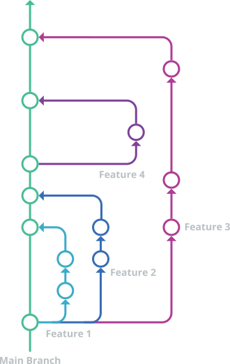

<!-- _header: '' -->
<!-- _footer: '' -->
<!-- _paginate: false -->

# Workflow de desenvolvimento: principais comandos Git e Shell
## SECOMP 2025
### Diego Augusto

-  [Diegovsky](https://github.com/Diegovsky)
-  [@diegovsky@fosstodon.org](https://fosstodon.org/@diegovsky)

---

# 0. Sobre Mim

<!-- Se ninguém rir de nada é isso aí mozão -->

Aluno de Ciência da Computação na UFSJ, 7º período

Trabalho na Codara como Desenvolvedor Backend

Sou técnico em informática pelo CEFET-MG

Fiquei esse Sábado das 8-14h configurando os pcs pra secomp (vide eu sábado ->)

Gosto demais de computação e de coisas extremamentes específicas

Copiei os slides do Minicurso de Docker

---

<!-- _class: lead invert -->

# Links!
TODO: Inserir links depois

link dos slides

repo dos slides

---

<!-- _class: title lead invert -->
# 1. O que é Git?

Git é uma ferramenta de controle de código-fonte (*source-control management*, ou SCM), originalmente criada pelo Linus Torvalds, criador do Freax.

Atualmente, é a mais utilizada para projetos de desenvolvimento por permitir que várias pessoas trabalhem no código em paralelo, sem interferências.

---
# 1.1 O que é o GitHub?

O GitHub é o que chamamos de **Git Forge**.

Um Git Forge facilita o uso do Git por um navegador, pois a única forma de interagir com um **repositório** é pela linha de comando.

Um Git Forge também oferece funcionalidades além do Git, como *Issues*, *Pull Requests*, CI/CD, Releases, etc.

Outros exemplos de Git Forge são: GitLab, Gitea e Forgejo.

---
# 1.2 O que é um repositório?

Um repositório é a pasta do seu projeto. 

No GitHub, os repositórios são identificados pelo usuário e o nome do projeto:

`<nome>/<projeto>`

Repositórios possuem várias **branches**, sendo uma a principal (master).

---
# 1.3 O que são branches?

Uma *Branch* (bifurcação) é um histórico de mudanças no código, ou **commits**. 

É possível criar uma branch nova a partir de uma já existente. Esse processo se chama **fork**.

Também é possível juntar duas branches já existentes. Esse processo se chama **merge**.

O relevante para esse mini-curso é um tipo específico de **merge**, o **rebase**.

---

<!-- _class: 'lead invert title' -->
# 1.99 Exercício!

1. Acessem suas contas do GitHub: https://github.com

2. Formem grupos de 2-3 integrantes, escolha um para ser o líder!

3. Líderes: criem um repositório: https://github.com/new

4. Adicionem os outros integrantes (próxima página)
---
<!-- _header: '' -->
<!-- _footer: '' -->

---

